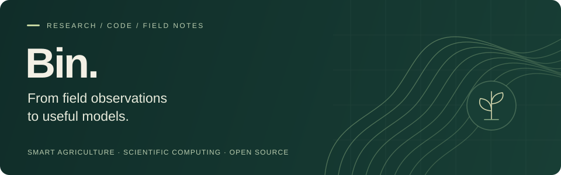
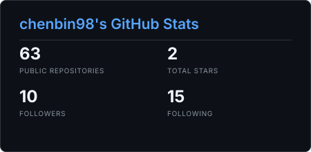

  

  <a href="https://chenbin98.github.io/">Academic website</a> &nbsp; / &nbsp;
  <a href="https://chenbin98.github.io/tech-blog/">Field notes &amp; code</a> &nbsp; / &nbsp;
  <a href="https://orcid.org/0009-0000-8266-940X">ORCID</a> &nbsp; / &nbsp;
  <a href="mailto:binc041208@gmail.com">Email</a>

### Hi, I'm Bin.

I'm a **PhD candidate in Smart Agriculture at Northwest A&F University**, working at the intersection of crop science and artificial intelligence. I'm interested in how field observations, crop models, and machine learning can inform agricultural decisions.

I build research workflows and practical tools, and share what I learn along the way.

### Research interests

- **Crop modeling** — crop growth, water management, and model calibration.
- **AI for agriculture** — machine learning, computer vision, and data analysis.
- **Earth observation** — remote sensing for understanding agricultural systems.

### Selected work

<table>
  <tr>
    <td width="50%" valign="top">
      01 / CROP MODELING
      <h3><a href="https://github.com/chenbin98/aquacrop_cotton_workflow">AquaCrop Cotton Workflow</a></h3>
      
Site-level workflows for weather and soil preparation, crop simulation, and parameter calibration.

      
<code>Python</code> <code>AquaCrop</code> <code>Calibration</code>

    </td>
    <td width="50%" valign="top">
      02 / RESEARCH TOOLS
      <h3><a href="https://github.com/chenbin98/Sci-Download-for-Zotero10">Sci-Download for Zotero 10</a></h3>
      
An independently maintained fork for DOI-based PDF retrieval, metadata lookup, and attachment management.

      
<code>TypeScript</code> <code>Zotero</code> <code>Maintained fork</code>

    </td>
  </tr>
  <tr>
    <td width="50%" valign="top">
      03 / ACADEMIC UTILITIES
      <h3><a href="https://github.com/chenbin98/nwafuPaperLevel">NWAFU Journal Lookup</a></h3>
      
A Django application for querying university and college journal classifications at Northwest A&amp;F University.

      
<code>Python</code> <code>Django</code> <code>Journal data</code>

    </td>
    <td width="50%" valign="top">
      04 / LEARNING IN PUBLIC
      <h3><a href="https://chenbin98.github.io/tech-blog/">Field Notes &amp; Code</a></h3>
      
My technical blog: a place to document experiments, share code, and connect research with practice.

      
<a href="https://chenbin98.github.io/tech-blog/">Read the blog →</a> &nbsp; <a href="https://github.com/chenbin98/tech-blog">Source →</a>

    </td>
  </tr>
</table>

### Let's connect

I'm interested in collaborating on **crop models, machine learning for agriculture, and research software**. Reach me by [email](mailto:binc041208@gmail.com), or explore my [academic website](https://chenbin98.github.io/) and [CV](./blob/ChenBin.pdf).

Away from the screen, you'll find me hiking, climbing mountains, or cooking.

  
GitHub at a glance

   
  
  
Snapshot: September 16, 2026. Automatic updates are not enabled.

---

从田间观察到模型实践 · From field observations to useful models.

